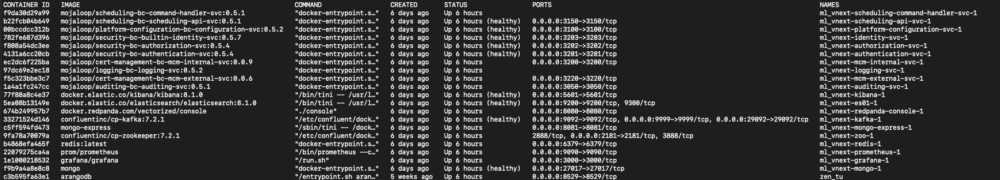
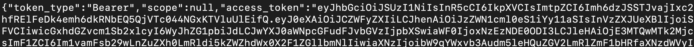

# Config-svc-be REST Service

A restful service for Tazama to allow for the configuration of Transaction Monitoring Services

- [NodeJS](https://nodejs.org/en/)
- [NestJS](https://nestjs.com/)
- [Arangodb](https://arangodb.com/)

## Installation

### Requirements

Before you get started, the following need to be installed:

- **[NodeJS](https://nodejs.org/en/)**. ***Version 20.10*** and above is currently used and we don't guarantee everything works with other versions. If you need to work with multiple versions of NodeJS, [NVM](https://github.com/nvm-sh/nvm/blob/master/README.md) is recommended.
- **[NestJS](https://nestjs.com/)**. ***Version 10.0.0*** is currently used to build our restful service. We don't guarantee everything works with other versions.
- **[npm](https://www.npmjs.com/)**. We are currently using npm to manage our dependancies.

### Pre-requisites.

It is assumed that you have installed Mojaloop Security BC and associated services.

## Clone the application
Clone the repo

```bash
https://github.com/wasswarichard/ArangoDB-Nestjs-JWT-Authorization-.git
```

cd into the repo

```bash
cd config-svc/packages/config-svc-be
```

Use the correct Node.js version

```bash
nvm use
```

Install dependencies

```bash
npm install
```

Add environment variables

```bash
cp ./.env.sample ./.env
```

Any Empty .env file should look as follows

```t
# Security BC Connection
AUTH_N_SVC_BASEURL=
AUTHORIZATION_BASEURL=
KAFKA_URL=
AUTH_N_TOKEN_ISSUER_NAME=
AUTH_N_TOKEN_AUDIENCE=

# Application Configurations
SVC_CLIENT_ID=
SVC_CLIENT_SECRET=
BC_NAME=
APP_NAME=
APP_VERSION=

# Arango Database Connection.
DATABASE_HOST=
DATABASE_NAME=
DATABASE_USERNAME=
DATABASE_PASSWORD=

# config-svc-be application port
PORT=
```

If you use a default installation, your .env file should be as follows:

```t
# Security BC Connection.
AUTH_N_SVC_BASEURL=http://localhost:3201  # the mojaloop/security-bc-authorization-svc:0.5.4 image running in docker
AUTHORIZATION_BASEURL=http://localhost:3202  #the  mojaloop/security-bc-authentication-svc:0.5.4 image running in docker
KAFKA_URL=localhost:9092  #the   confluentinc/cp-kafka:7.2.1  image running in docker
AUTH_N_TOKEN_ISSUER_NAME=mojaloop.vnext.dev.default_issuer # default secuirty-bc token authentication issuer name
AUTH_N_TOKEN_AUDIENCE=mojaloop.vnext.dev.default_audience # default security-bc token authentication audience

# Application Configurations
SVC_CLIENT_ID=lextego  # specifiies the created application client id
SVC_CLIENT_SECRET=lextego-secret #specifies created application client secret
BC_NAME=lextego-bc # identifies the application privileges (they are variables)
APP_NAME=lextego-svc # identifies the application privileges (they are variables)
APP_VERSION=0.5.5 # this is a random version to version the privileges. it should from 0.5 on wards

# Arango Database Connection.
DATABASE_HOST=http://localhost:8529/  # the port specified in the -p 8529:8529
DATABASE_NAME=_system  # the database name specified in the --server.database _system:
DATABASE_USERNAME=root # the database username specified in  the --server.username root:
DATABASE_PASSWORD=1 # the database password specified in the --server.password pass:

# config-svc-be application port
PORT=3007 # specifiy the port on which you want to run the application (default port is 3007)
```

## Install ArangoDB with Docker

If you have not installed Arango, as part of another service, the recommended way of using it on a local machine is via docker according to the [documentation](https://docs.arangodb.com/3.11/operations/installation/docker/).

You can choose one of the following:

- [arangodb official Docker images](https://hub.docker.com/_/arangodb) , verified and published by Docker.
- [arangodb/arangodb Docker images](https://hub.docker.com/r/arangodb/arangodb), maintained and directly published by ArangoDB regularly.

## Start an ArangoDB instance

In order to start an ArangoDB instance, run:

```bash
docker run -e ARANGO_ROOT_PASSWORD=1 -p 8529:8529 -d --name arangodb-instance arangodb/arangodb
```

- `-e ARANGO_ROOT_PASSWORD=1:` The -e flag is used to set environment variables inside the container. In this case, ARANGO_ROOT_PASSWORD=1 sets the root password of the ArangoDB instance to 1. It's important to choose a secure password for production environments.
- `-p 8529:8529:` The -p flag maps a port on the host to a port in the container. This command maps port 8529 on the host to port 8529 inside the container, which is the default port that ArangoDB listens on for connections.
- `-d:` This flag runs the container in detached mode, meaning the container runs in the background and does not block the terminal session.
- `--name arangodb-instance:` The --name flag assigns a name to the container, making it easier to manage. In this case, the container is named arangodb-instance.
- `arangodb/arangodb:` This specifies the image to use for the container. arangodb/arangodb is the official ArangoDB image from Docker Hub. Docker will download this image the first time you run the command if it's not already present on your system.

### ArangoDB Interaction Command-line Interface (CLI)

You can use [arangosh](https://docs.arangodb.com/3.11/components/tools/arangodb-shell/), an interactive shell that ships with ArangoDB, and its [JavaScript API](https://docs.arangodb.com/3.11/develop/javascript-api/@arangodb/db-object/), to interact with the server. You can also use it for automating tasks.

In order to interact with the ArangoDB instance with CLI

```bash
docker exec -it arangodb-instance arangosh --server.username root --server.password 1 --server.database _system
```

- `-it:` These flags are combined to allow interactive processes. -i (interactive) keeps STDIN open even if not attached, and -t (tty) allocates a pseudo-TTY, making it possible for you to interact with the shell inside the container.
- `arangodb-instance:` This is the name of the Docker container in which ArangoDB is running. You specified this name when you started the container with the docker run command.
- `arangosh:` This is the command being executed inside the Docker container. arangosh is the ArangoDB shell, which allows you to interact directly with your ArangoDB server using a command-line interface.
- `--server.username root:` This option specifies the username to use when connecting to the ArangoDB server. In this case, you're using the root user.
- `--server.password 1:` This option specifies the password for the user. You set this password to 1 when you started the container. For security reasons, it's important to use a strong, unique password, especially in production environments.
- `--server.database _system:` This option specifies the name of the database to connect to. \_system is the default system database provided by ArangoDB for managing the server.

Update the Arango Database Connection environment variables as follows

```t
# Arango Database Connection.
DATABASE_HOST=http://localhost:8529/  # the port specified in the -p 8529:8529
DATABASE_NAME=_system  # the database name specified in the --server.database _system:
DATABASE_USERNAME=root # the database username specified in  the --server.username root:
DATABASE_PASSWORD=1 # the database password specified in the --server.password pass:
```

#### Accesing Arango

Should you need to access the Arango Front End, you can use their [portal](http://localhost:8529/) the credentials we created above are as follows:

UserName: Root  
Password: 1  

## Deploying the Platform Shared Tools
Please follow the instructions in the [mojaloop platform shared tools deployment](https://github.com/lextego/config-svc/blob/main/docs/02-deployment/90-mojaloop-platform-shared-tools-deployment.md) readme to deploy the Mojaloop Platform Shared Tools
- In order to check the images with cli run

```bash
docker ps
```



Update the Mojaloop Platform Shared Tools environment variables as follows

```t
# Security BC Connection.
AUTH_N_SVC_BASEURL=http://localhost:3201  # the mojaloop/security-bc-authorization-svc:0.5.4 image running in docker
AUTHORIZATION_BASEURL=http://localhost:3202  #the  mojaloop/security-bc-authentication-svc:0.5.4 image running in docker
KAFKA_URL=localhost:9092  #the   confluentinc/cp-kafka:7.2.1  image running in docker
AUTH_N_TOKEN_ISSUER_NAME=mojaloop.vnext.dev.default_issuer # default secuirty-bc token authentication issuer name
AUTH_N_TOKEN_AUDIENCE=mojaloop.vnext.dev.default_audience # default security-bc token authentication audience
```

## configuration of the custom service / Application

- Log into the authentication service of the security bound context running http://localhost:3201 (The Mojaloop/security-bc-authentication-svc:0.5.4 running in docker)using the default login credentials defined in [Mojaloop vNext admin UI](https://github.com/lextego/config-svc/blob/main/docs/02-deployment/90-mojaloop-platform-shared-tools-deployment.md#install)
- 
```postgres-sql
curl --location 'http://localhost:3201/token' \
--header 'Content-Type: application/json' \
--data '{
    "grant_type": "password",
    "client_id": "security-bc-ui",
    "username": "admin",
    "password": "superMegaPass"
}'
```

- The response contains an access_token to be used in creating an application

- Create an application using the endpoint http://localhost:3203/ (the mojaloop/security-bc-builtin-identity-svc:0.5.7  image running in docker) that identifies the service by providing clientId and clientSecret as variables. In this we are going to use ```lextego``` as our ```clientId```, ```lextego-secret``` as our ```clientSecret``` and update the Authorization bearer token with the newly obtained access token. If you get an error ```{"status":"error","msg":"Invalid client_id."}%```, it means the clientId already exists therefore provide a new clientId variable name.

```bash
curl --location 'http://localhost:3203/apps/' \
--header 'Content-Type: application/json' \
--header 'Authorization: Bearer <New_BearerTOKEN>' \
--data '{
    "enabled": true,
    "clientId": "lextego",
    "platformRoles": [],
    "clientSecret": "lextego-secret",
    "canLogin": true
}'
```

- Assign the created application a basic role using the endpoint ```http://localhost:3203/apps/${clientId}/roles/``` providing the clientId as lextego for created application

```bash
curl --location 'http://localhost:3203/apps/lextego/roles/' \
--header 'Content-Type: application/json' \
--header 'Authorization: Bearer <New_BearerTOKEN>' \
--data '[
    {
        "roleId": "basic-application"
    }
]'
```

Update the application configuration environment variables as follows depending on the created application

```t
# Application Configurations
SVC_CLIENT_ID=lextego  # specifiies the created application client id
SVC_CLIENT_SECRET=lextego-secret #specifies created application client secret
BC_NAME=lextego-bc # identifies the application privileges (they are variables)
APP_NAME=lextego-svc # identifies the application privileges (they are variables)
APP_VERSION=0.5.5 # this is a random version to version the privileges. it should from 0.5 on wards
```

update the config-svc-be application port (optional as it runs on a default port of 3007)

```t
# config-svc-be application port
PORT=3007 # specifiy the port on which you want to run the application (default port is 3007)
```

## Run the application

```bash
npm run start
```

Run the application on **hot-reload**

```bash
npm run start:dev
```

- At this time you can test the config-svc-be on http://localhost:3007/.
- Access the endpoint swagger documentation on http://localhost:3007/swagger#/

## Unit testing

Running unit tests

```bash
npm run test
```

Running end to end tests

```bash
npm run test:e2e
```
