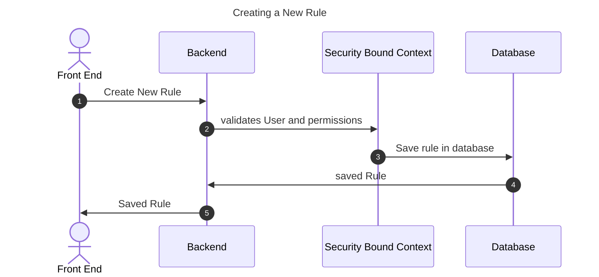
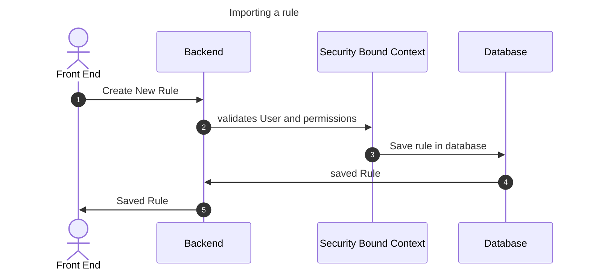
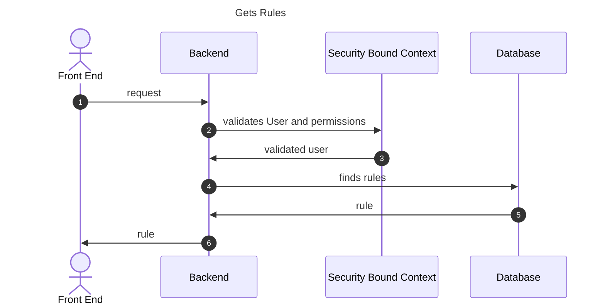
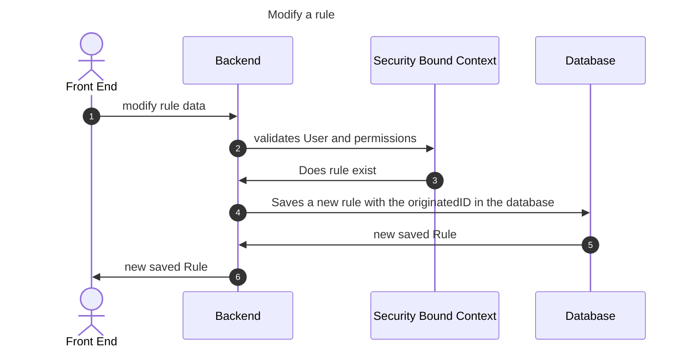
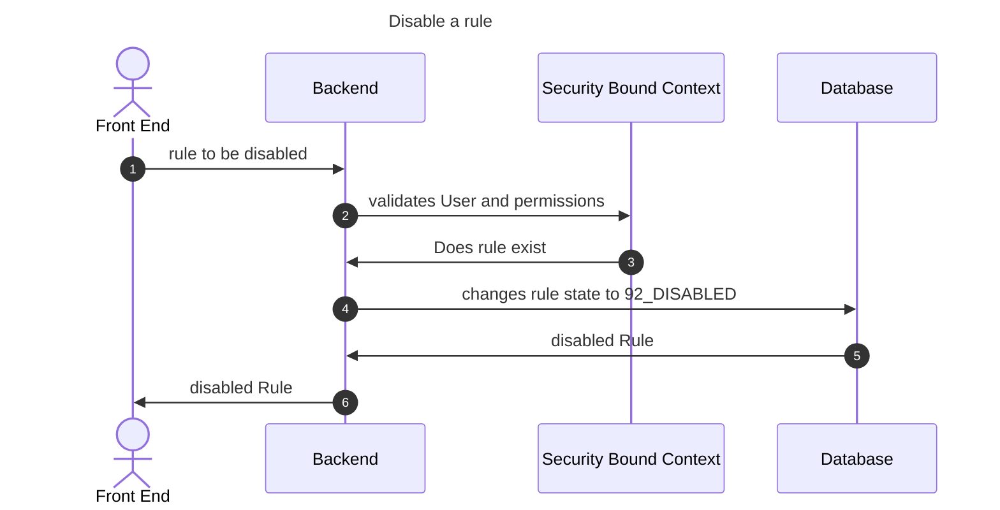
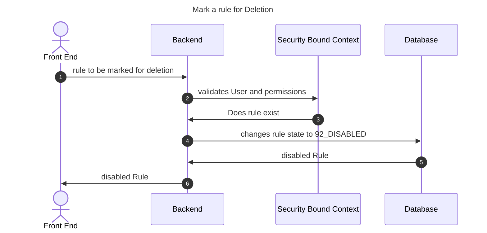

## Introduction

Once a user has been authenticated via the login service, if they have sufficient access rights because of their role, they can now do the following with rules:

- Create
- Import a Draft
- Save a draft
- Delete a Draft Rule
- Disable non Draft Rules
- Review any Rule type
- Modify any Rule type
- Submit a Draft rule for Approval

This documentation assumes an understanding of the [flow of artefacts](50_flow_of_artefacts.md) and [states](51_states.md) of any event

## Rules
### Create a Rule
The service will allow for a Rule to be created

### Import a Rule

### Get Rule

### Get Rules

### Modify a Rule

### Disable a Rule

### Mark a Rule For Deletion
